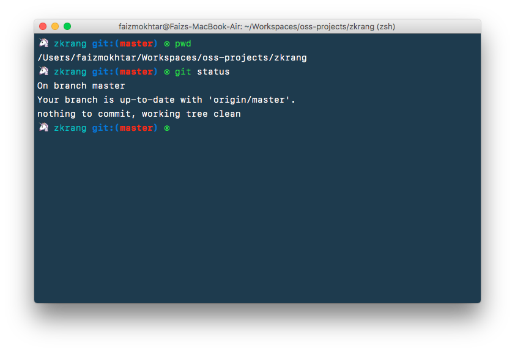

# zkrang themes

A minimalistic theme that I use for my zsh + iTerm2.



Further configuration:
  * [Cobalt2 color schemes](http://iterm2colorschemes.com/)
  * 14pt SF Mono Light

## Installation

### with [antigen](https://github.com/zsh-users/antigen)

Run the following or append it to your `~/.zshrc`.

```
antigen theme faizmokhtar/zkrang themes/zkrang
```

## License

This project is licensed under the MIT License - see the [LICENSE.md](LICENSE.md) file for details

## Acknowledgements
* 🦄 emoji inspired by [@noopkat](https://twitter.com/noopkat) from watching her [stream](https://www.twitch.tv/noopkat).
